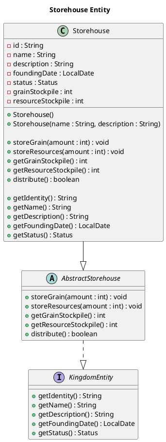

# Storehouse UML Diagram

```plantuml
@startuml

title Storehouse Entity

interface KingdomEntity {
    +getIdentity() : String
    +getName() : String
    +getDescription() : String
    +getFoundingDate() : LocalDate
    +getStatus() : Status
}

abstract class AbstractStorehouse {
    +storeGrain(amount : int) : void
    +storeResources(amount : int) : void
    +getGrainStockpile() : int
    +getResourceStockpile() : int
    +distribute() : boolean
}

class Storehouse {
    -id : String
    -name : String
    -description : String
    -foundingDate : LocalDate
    -status : Status
    -grainStockpile : int
    -resourceStockpile : int

    +Storehouse()
    +Storehouse(name : String, description : String)

    +storeGrain(amount : int) : void
    +storeResources(amount : int) : void
    +getGrainStockpile() : int
    +getResourceStockpile() : int
    +distribute() : boolean

    +getIdentity() : String
    +getName() : String
    +getDescription() : String
    +getFoundingDate() : LocalDate
    +getStatus() : Status
}

AbstractStorehouse ..|> KingdomEntity
Storehouse --|> AbstractStorehouse

@enduml
```